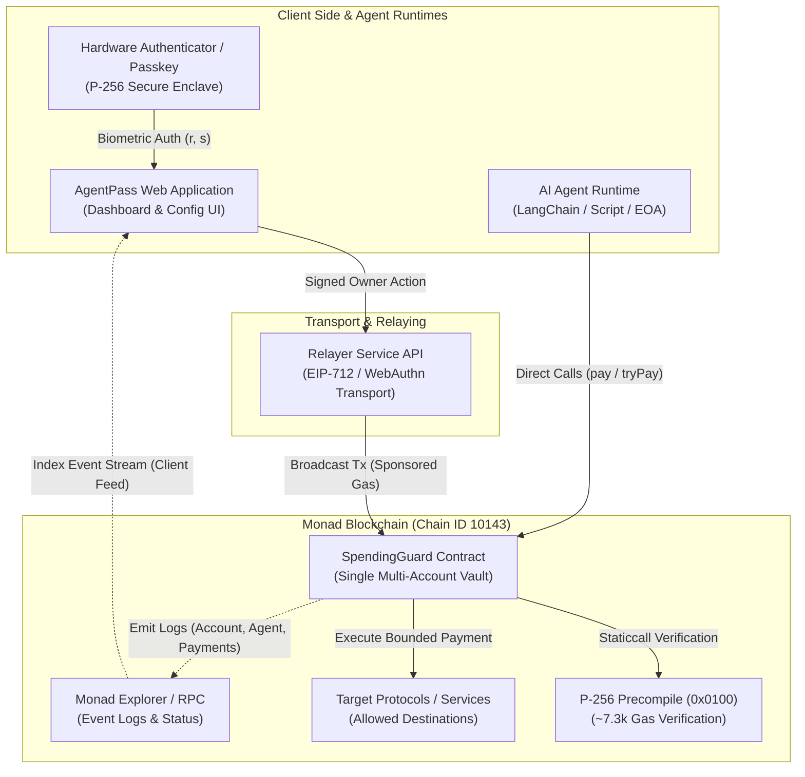
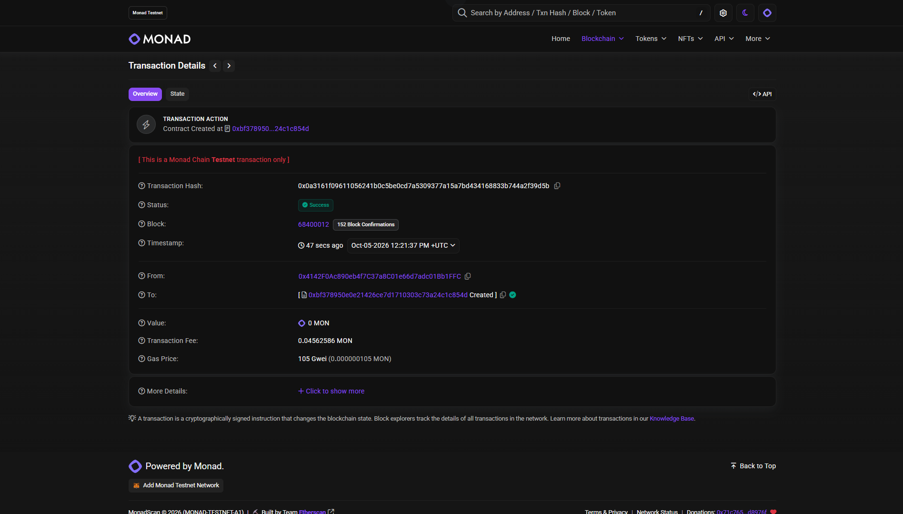
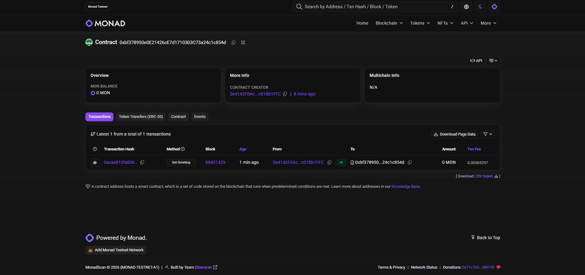

# AgentPass

A reusable spending-limit and verifiable identity layer for autonomous AI agents on Monad. Built for the Metropolis Hackathon.

**Repo:** https://github.com/dhanushkumar-amk/AGENTPASS-METROPOLIS-HACKTHON-PROJECT

---

## Track

**Trust, Identity & AI Infrastructure**

---

## The Problem

AI agents increasingly hold private keys and execute transactions autonomously on-chain. However, giving an agent an unconstrained private key creates an all-or-nothing security risk:
- **No budget boundaries:** A rogue, hallucinating, or prompt-injected agent can drain all funds in a single transaction.
- **No attribution:** When multiple agents operate, on-chain observers cannot reliably identify which agent initiated an action.
- **Binary delegation:** Owners must either give full access or no access, with no granular policy enforcement (per-tx caps, daily velocity limits, approved contracts).

---

## The Solution

AgentPass introduces a programmable smart-account and policy layer tailored for AI agents:
1. **Verifiable Identity:** Each agent is registered with an on-chain identity linked to its human owner.
2. **Deterministic Spending Limits:** Owners define strict spending policies (per-transaction maximums, periodic allowances, and target contract allowlists).
3. **Provable Attribution:** Every action taken by an agent is signed, validated against the owner's policy, and attributed to that specific agent identity.

---

## How It Uses Monad

AgentPass is purpose-built to take advantage of Monad's high-performance architecture:
- **Sub-Second Settlement:** Monad's 1-second block times and high throughput enable agents to execute micro-transactions without waiting on lengthy confirmations.
- **Low-Cost Policy Checks:** Complex on-chain limit validations and multi-call spending checks remain economically viable at scale due to Monad's low gas fees.
- **Parallelized Agent Activity:** Multiple agents operating under the same owner can transact concurrently without bottlenecking on sequential account nonces.
- **Full EVM Compatibility:** The contracts utilize standard Solidity (0.8.28, Prague EVM) compiled via Foundry, allowing seamless integration with viem, cast, and standard Ethereum tooling.

---

## Architecture Overview (Design)

AgentPass is designed as a foundational infrastructure layer providing deterministic spending limits and passkey-verifiable identity for autonomous AI agents on Monad Testnet (Chain ID `10143`).

The architecture centers on a single non-custodial smart contract, `SpendingGuard`:
- **Passkey Owner Identity:** Human owners control vault accounts using hardware WebAuthn passkeys (P-256 / secp256r1). Management actions (setting budgets, allowlisting targets, registering/revoking agents, emergency pausing, and withdrawals) are authorized on-chain via Monad's native P-256 precompile at `0x0100`.
- **Relayer Submission:** Owner actions are submitted through an untrusted relayer, providing a gasless owner experience while sequential account nonces prevent replay attacks.
- **Agent Execution (`pay` & `tryPay`):** Autonomous AI agents transact directly with `SpendingGuard` from their own EOAs. Transactions are strictly bounded by daily velocity limits (24-hour UTC window) and destination allowlists. `tryPay()` provides non-reverting execution with structured `PaymentBlocked` event telemetry.
- **Serverless Event Feed:** Client applications and dashboards reconstruct account states and transaction streams directly from on-chain event logs without requiring a centralized database.



### Workspace Structure

- `contracts/` — Foundry project with smart contracts, unit/fuzz tests, and deployment scripts.
- `web/` — Next.js dashboard for agent provisioning, policy configuration, and live activity tracking (Phase 6).
- `agent/` — Autonomous agent runtime scripts and LangChain/LLM integrations (Phase 6).
- `scripts/` — Automated bash utilities for RPC health checks, wallet validation, and contract deployment.
- `docs/` — Architecture notes, deployment logs, and RPC provider guides.

---

## Tech Stack

- **Smart Contracts:** Solidity 0.8.28, Foundry 1.8.4 (`network = "monad"`, Prague EVM), forge-std
- **Target Network:** Monad Testnet (Chain ID `10143`)
- **Cryptographic Verification:** Native P-256 (secp256r1) precompile at `0x0000000000000000000000000000000000000100` (EIP-7951 / RIP-7212 verified on-chain, ~7.3k gas for passkey authentication)
- **Account Model:** Direct Vault with Passkey Owner & EIP-712 Meta-Transaction Relayer (bypassing external ERC-4337 bundlers for lower latency and self-sovereign execution)
- **Agent Identity Layer:** ERC-8004 Tokenized Identity Registry (`0x8004A818BFB912233c491871b3d84c89A494BD9e` verified on Monad Testnet)
- **Frontend / Dashboard:** Next.js, React, TypeScript, Tailwind CSS, shadcn/ui, viem (Planned - Phase 6)
- **Agent Runtime:** TypeScript / Python, LangChain, OpenAI / Anthropic APIs (Planned - Phase 6)
- **RPC & Infrastructure:** QuickNode Monad Testnet RPC (`QUICKNODE_RPC_URL`), Cast / Forge toolchain

---

## Contracts

The protocol smart contracts are located in `contracts/src/`:

| Contract | Role | Status | Description |
| --- | --- | --- | --- |
| `ISpendingGuard` | Interface | Specified | Interface defining data structures, events, custom errors, and method signatures |
| `SpendingGuardBase` | Core Logic | Work-in-Progress (Phase 8 Done) | Abstract base contract implementing accounts, deposits, agent registration, nonces, `pay`, non-reverting `tryPay`, daily spending limit velocity, rollover, and views |
| `HelloMonad` | Pipeline Check | Deployed | Initial pipeline verification contract on Monad Testnet |

*Note: `SpendingGuardBase` implements Phases 7 and 8 (accounts, deposits, agents, views, digests, `pay`, `tryPay`, daily limit window, rollover, and solvency invariants). Future scope logic (allowlist mutations in Phase 9, owner lifecycle/freeze in Phase 10, native P-256 precompile verification in Phase 14) remains safely deferred.*

---

## Deployed Contract Addresses

| Contract | Network | Address | Explorer Link | Status |
| --- | --- | --- | --- | --- |
| HelloMonad (Pipeline Check) | Monad Testnet (`10143`) | `0xbf378950e0e21426ce7d1710303c73a24c1c854d` | [Monadscan](https://testnet.monadscan.com/address/0xbf378950e0e21426ce7d1710303c73a24c1c854d) | Active |
| AgentRegistry | Monad Testnet (`10143`) | _To be deployed in Phase 5_ | — | Planned |
| SpendingPolicyManager | Monad Testnet (`10143`) | _To be deployed in Phase 5_ | — | Planned |
| AgentWalletFactory | Monad Testnet (`10143`) | _To be deployed in Phase 6_ | — | Planned |

### On-Chain Verification & Explorer Evidence

| Contract Deployment Transaction | Confirmed State Interaction (`Set Greeting`) |
| :---: | :---: |
|  |  |
| *MonadScan: Deployment Tx (`0x0a3161f0...`)* | *MonadScan: On-chain `Set Greeting` call (`0xcae810fa...`)* |

---

## Setup and Run Instructions

### 1. Prerequisites

- **OS:** Linux or WSL2 (Ubuntu 22.04+ recommended)
- **Foundry:** 1.8.4+ (`forge`, `cast`)
- **Node.js:** 18.x or 20.x
- **Python:** 3.10+ (for optional agent runtime)

### 2. Environment Setup

1. Copy `.env.example` to `.env`:
   ```bash
   cp .env.example .env
   ```
2. Populate the required environment variables:
   - `QUICKNODE_RPC_URL`: Your Monad testnet RPC endpoint.
   - `DEPLOYER_PRIVATE_KEY`: Private key for a testnet-only deployer account.
   - `EXPECTED_CHAIN_ID`: Set to `10143`.
3. Validate RPC connectivity and latency:
   ```bash
   ./scripts/check-rpc.sh
   ```
4. Verify wallet address derivation and funding:
   ```bash
   ./scripts/check-wallet.sh
   ```

### 3. Smart Contracts (Foundry)

1. Compile contracts:
   ```bash
   cd contracts && forge build
   ```
2. Run test suite (unit and fuzz tests):
   ```bash
   forge test -vv
   ```
3. Generate gas consumption report:
   ```bash
   forge test --gas-report
   ```
4. Deploy pipeline verification contract:
   ```bash
   cd .. && ./scripts/deploy-hello.sh
   ```

### 4. Web Dashboard (Upcoming)

```bash
cd web
npm install
npm run dev
```
Open [http://localhost:3000](http://localhost:3000) to view the agent management interface.

### 5. AI Agent Runtime (Upcoming)

```bash
cd agent
npm install # or pip install -r requirements.txt
npm run start
```

---

## Roadmap

- [x] **Phase 1:** Project scaffold, licensing, and `.env.example` baseline.
- [x] **Phase 2:** Automated RPC health check (`scripts/check-rpc.sh`) with latency measurement.
- [x] **Phase 3:** Foundry environment setup and funded deployer wallet validation (`scripts/check-wallet.sh`).
- [x] **Phase 4:** Pipeline contract deployment (`HelloMonad`) on Monad testnet with on-chain verification.
- [ ] **Phase 5:** Core `AgentRegistry` and `SpendingPolicyManager` contracts with fuzz-tested limit checks.
- [ ] **Phase 6:** Agent wallet smart account implementation and autonomous agent execution script.
- [ ] **Phase 7:** Next.js dashboard UI for owner configuration and live agent audit feed.
- [ ] **Phase 8:** End-to-end hackathon demo video and final submission.

---

## Demo Video

_The video walk-through demonstrating agent limit enforcement on Monad testnet will be added here ahead of the hackathon deadline._

---

## AI Tools Used

AI coding assistants (Command Code, Google Antigravity) were utilized for repository scaffolding, test design, documentation generation, and rapid prototyping. All architecture decisions, security boundaries, and committed code are reviewed and verified by the builder.

---

## External Libraries and Attribution

- [Foundry](https://github.com/foundry-rs/foundry) — Fast portable Solidity toolkit (Apache-2.0 / MIT).
- [forge-std](https://github.com/foundry-rs/forge-std) — Testing and scripting primitives for Foundry (MIT).
- [OpenZeppelin Contracts](https://github.com/OpenZeppelin/openzeppelin-contracts) — Battle-tested smart contract libraries (MIT, pinned to tag `v5.7.0`).
- [viem](https://viem.sh/) — TypeScript interface for Ethereum and EVM chains (MIT).

---

## License

MIT — see [LICENSE](LICENSE).
