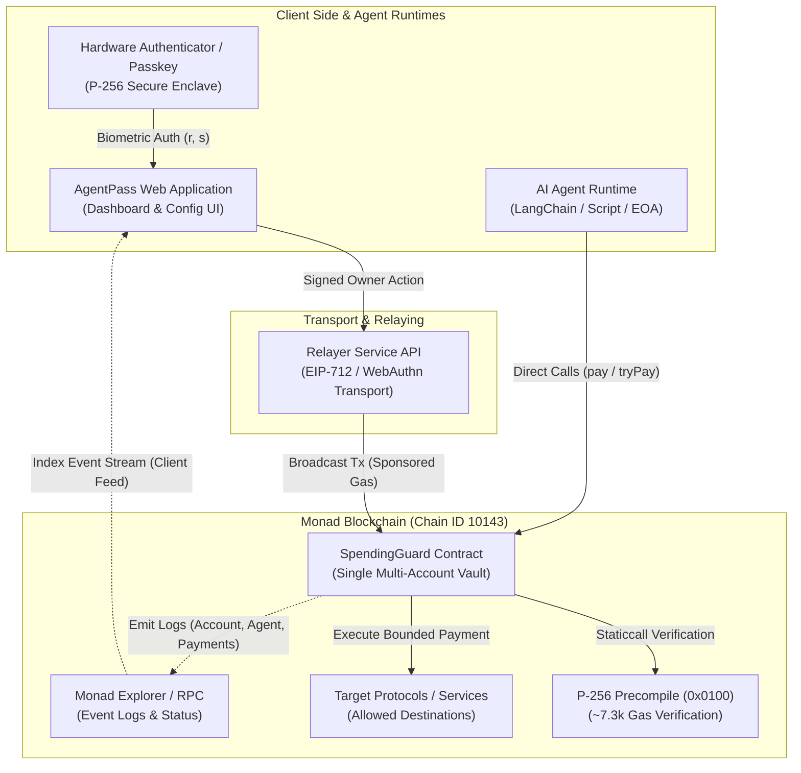
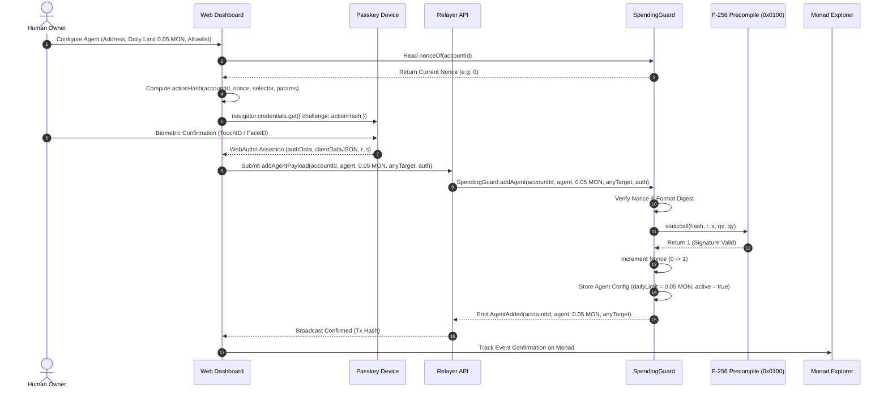
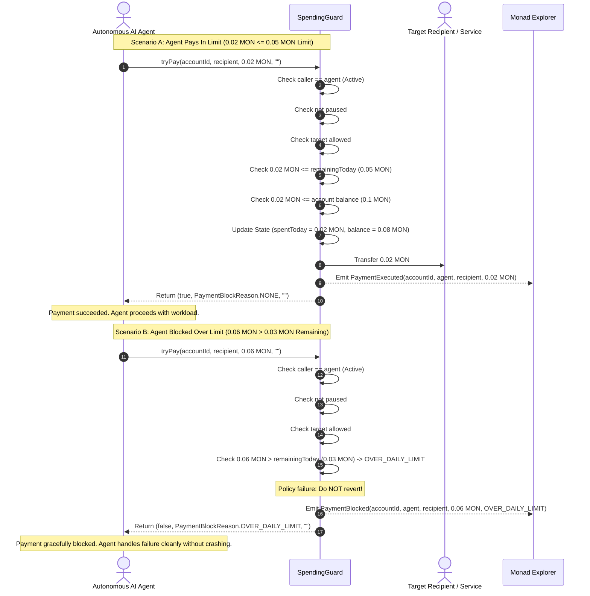

# AgentPass Architecture Specification

## Overview

**AgentPass** is a reusable spending-limit and verifiable identity infrastructure layer designed for autonomous AI agents on Monad Testnet (Chain ID `10143`). It operates as an infrastructure primitive that external protocols, multi-agent frameworks, and decentralized applications integrate to grant controlled, policy-bounded on-chain execution power to AI agents.

AgentPass separates the **human owner identity** (secured by WebAuthn passkeys via secp256r1/P-256) from the **agent runtime keys** (ephemeral or persistent EOAs holding autonomous execution rights). The protocol is encapsulated within a single non-custodial smart contract: `SpendingGuard`.

---

## Actors and Trust Assumptions

The AgentPass architecture defines four core entities:

### 1. Human Owner
- **Role:** Root administrator and capital provider for an account vault.
- **Key Material:** Hardware-enclosed P-256 (secp256r1) keypair generated via WebAuthn / Passkeys (Apple TouchID/FaceID, Windows Hello, Android Biometrics, or YubiKeys).
- **Identity Derivation:** The account identifier `accountId` is deterministically derived as:
  $$\text{accountId} = \text{keccak256}(\text{abi.encode}(qx, qy))$$
  where $(qx, qy)$ are the 32-byte coordinates of the P-256 public key.
- **Capabilities:** Authorizes agent registration, updates daily spending velocity caps, manages target allowlists, triggers emergency freezes (`setPaused`), and withdraws unspent native MON.
- **Trust Assumption:** The owner's private key never leaves the hardware Secure Enclave. The owner only signs typed action digests. Malicious compromise requires physical hardware access and biometric bypass.

### 2. Relayer
- **Role:** Gasless transaction submitter and transport pipeline.
- **Responsibilities:** Receives owner-signed action payloads and WebAuthn authentication proofs, packs them into on-chain transactions, and broadcasts them to Monad.
- **Trust Assumption:** **Untrusted transport.** 
  - The relayer cannot forge or tamper with owner actions because the signed digest strictly commits to `chainId`, contract address, `accountId`, sequential `nonce`, action selector, and all call parameters.
  - The relayer cannot replay past transactions due to strict sequential nonces enforced on-chain.
  - The relayer can at worst delay or censor a submission; the owner can bypass censorship at any time by self-submitting the transaction from any EOA or using alternative relayers.

### 3. Autonomous AI Agent
- **Role:** On-chain actor executing autonomous tasks (e.g. trading, purchasing compute/data, paying API fees, or interacting with DeFi protocols).
- **Key Material:** Standard Ethereum EOA private key (secp256k1) stored in the agent's runtime memory or key manager.
- **Capabilities:** Authorized to invoke `pay()` (strict reverting) and `tryPay()` (graceful non-reverting) on `SpendingGuard` up to its assigned daily limit and destination constraints.
- **Trust Assumption:** **Semi-trusted / bounded risk.**
  - AI agents are vulnerable to prompt injection, model hallucinations, compromised dependencies, and runtime leaks.
  - **Blast radius containment:** An agent key compromise cannot drain the vault balance. Losses are strictly capped to the unspent portion of the agent's `dailyLimit` for that 24-hour UTC window.
  - If an agent is detected behaving erratically, the owner can instantly invoke `revokeAgent` or freeze the account via `setPaused`.

### 4. Vault (`SpendingGuard`)
- **Role:** The sole smart contract holding deposited native MON and enforcing spending policies on Monad.
- **Storage Isolation:** Funds are partitioned per `accountId`. Cross-account drainage is mathematically impossible.
- **Cryptographic Verification:** Validates owner WebAuthn signatures directly against Monad's native P-256 precompile at address `0x0000000000000000000000000000000000000100`.
- **Trust Assumption:** Non-custodial, immutable, and deterministic. No external upgrade proxies or privileged backdoors.

---

## Architecture Diagrams

### Diagram 1: System Component Diagram

---

### Diagram 2: Sequence Diagram — Owner Creates Agent Budget

---

### Diagram 3: Sequence Diagram — Agent Payment In Limit vs Blocked Over Limit

---

## Data Flow for Dashboard Activity Feed (Zero-Database Architecture)

The AgentPass dashboard operates entirely on **decentralized, serverless on-chain event indexing**. No centralized database, PostgreSQL instance, or proprietary cloud backend is required.

### 1. Event Log Stream
All state transitions within `SpendingGuard` emit indexed Solidity events:

| Event | Indexed Topics | Data Payload | Frontend Consumption |
| --- | --- | --- | --- |
| `AccountCreated` | `accountId` | `qx`, `qy` | Account discovery & registration verification |
| `Deposited` | `accountId`, `sender` | `amount` | Inbound capital credit ledger |
| `AgentAdded` | `accountId`, `agent` | `dailyLimit`, `anyTarget` | Agent list & initial budget allocation |
| `DailyLimitUpdated` | `accountId`, `agent` | `oldLimit`, `newLimit` | Budget history timeline |
| `TargetAllowedSet` | `accountId`, `agent`, `target` | `allowed` | Destination whitelist matrix |
| `AgentRevoked` | `accountId`, `agent` | — | Agent status deactivation |
| `PausedSet` | `accountId` | `paused` | Emergency freeze status badge |
| `Withdrawn` | `accountId`, `recipient` | `amount` | Outbound owner withdrawals |
| `PaymentExecuted` | `accountId`, `agent`, `target` | `amount` | Approved transaction feed & daily velocity curve |
| `PaymentBlocked` | `accountId`, `agent`, `target` | `amount`, `reason` | Security audit alerts & policy denial telemetry |

### 2. Client-Side Aggregation Pipeline
1. **Initial Hydration:** When an owner connects via WebAuthn, the web application computes `accountId` and queries Monad RPC using `eth_getLogs` with `topics[1] = accountId`.
2. **Reconstruction:**
   - Account balance is verified against `accountOf(accountId).balance`.
   - Active agents are collected from `AgentAdded` and filtered by `AgentRevoked`.
   - `PaymentExecuted` and `PaymentBlocked` events are merged chronologically to render the unified activity feed.
3. **Real-Time Subscription:** Viem `watchContractEvent` establishes a WebSocket / polling filter on `SpendingGuard` for new events matching `accountId`. Incoming blocks append events instantly to the UI feed.

---

## How It Uses Monad

AgentPass leverages the unique architectural features of Monad:

### 1. Native P-256 Precompile (`0x0100`)
Monad provides a native secp256r1 precompile compliant with RIP-7212/EIP-7951 at address `0x0000000000000000000000000000000000000100`. 
- **Gas Efficiency:** Pure EVM software implementations of P-256 verification (e.g., FCL, Daimo) consume between 300,000 and 450,000 gas per verification. Monad's native precompile verifies a passkey signature in **~7,293 gas** — a **98% gas reduction**.
- **User Experience:** This enables native biometric smartphone passkey authorization for sub-cent gas fees directly at the protocol level.

### 2. Sub-Second Finality and High Throughput
Autonomous AI agent runtimes cannot tolerate multi-minute settlement delays. Monad's 1-second block times and high transaction throughput ensure that:
- Agent payment calls (`pay` and `tryPay`) execute with near-instant confirmation.
- Policy decisions provide deterministic, immediate feedback into the agent's LLM reasoning loop.

### 3. Low Gas Costs and Gas Limit Sensitivity
- **Micro-Payment Viability:** Frequent on-chain budget validations and micro-payments (e.g. paying 0.001 MON for API access or decentralized inference) remain economically viable.
- **Gas Limit Awareness:** On Monad, transactions are charged against the transaction **gas limit** rather than gas used. The AgentPass SDK computes tight, accurate gas limits so autonomous agents never overpay for execution capacity.

### 4. Smart Contracts vs EOA Reserve Rule
Monad enforces a **10 MON reserve balance requirement** on standard Externally Owned Accounts (EOAs) to prevent state bloat, but **contracts are exempt from this reserve requirement**.
- Because AgentPass accounts are managed within the `SpendingGuard` smart contract rather than standalone EOAs, user vaults are not locked behind the 10 MON minimum balance rule.
- Agent worker keys only require minimal dust balances to cover transaction execution fees.

### 5. Account Decoupling & Rate Limit Mitigation
Monad nodes enforce rapid transaction thresholds (~1.2 seconds between sequential transactions from the same EOA). 
- In AgentPass, each agent transacts from its own EOA address.
- Multiple agents under the same owner execute concurrently without sequential nonce contention or wallet rate limit collisions.
